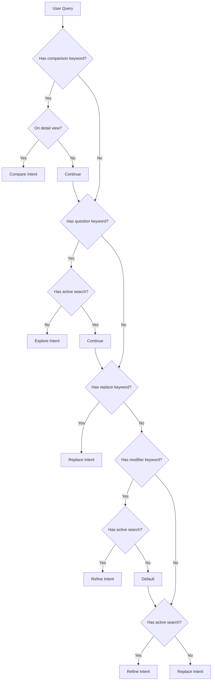

# AI Intent Classification System

## Overview

The `IntentInterpreter` service provides intelligent classification of natural language vehicle search queries. It analyzes user input in context to determine search intent, extract structured filters, and guide execution strategy.

## Intent Types

### 1. Refine Intent
**Definition**: User wants to narrow or add constraints to the current active search without starting over.

**Indicators**:
- Modifier keywords: "under", "below", "above", "only", "with", "without", "newer", "older", "closer"
- Presence of existing active search
- Screen context: Expanded map or chat with results

**Examples**:
- "under 30k"
- "only black ones"
- "newer than 2022"
- "with AWD"
- "closer to downtown"

**Execution Strategy**:
- Merge new filters with existing filters
- Price constraints become MORE restrictive
- Preserve map region unless location explicitly changed
- Keep existing result set visible while fetching refined results

**Filter Merging Logic**:
```swift
// Price refinement
newFilters.maxPrice = min(existingFilters.maxPrice ?? Int.max, parsedMaxPrice)
newFilters.minPrice = max(existingFilters.minPrice ?? 0, parsedMinPrice)

// Make/model adds constraint
if existingFilters.make == nil { newFilters.make = parsedMake }
if existingFilters.model == nil { newFilters.model = parsedModel }
```

### 2. Replace Intent
**Definition**: User wants to start a completely new search, clearing previous context.

**Indicators**:
- Replace keywords: "actually", "instead", "start over", "show me", "find me", "search for"
- No existing active search (chat context)
- Both category AND geography change in query

**Examples**:
- "actually show me trucks"
- "search in Dallas instead"
- "start over with EVs"
- "find me sedans under 25k"
- "show me SUVs in Charlotte"

**Execution Strategy**:
- Clear all existing filters
- Extract new filters from query only
- Reset map region to new location or default
- Replace result set entirely

**Filter Reset Logic**:
```swift
// Start fresh
var newFilters = InventorySearchRequest.InventoryFilters()
// Extract only from current query
newFilters = extractFilters(from: currentQuery)
```

### 3. Compare Intent
**Definition**: User wants to find vehicles similar to a specific reference vehicle (usually from detail view).

**Indicators**:
- Comparison keywords: "similar", "like this", "same", "comparable", "this one"
- Screen context: Vehicle detail view
- Presence of selected vehicle reference

**Examples**:
- "show me similar to this"
- "same model with lower miles"
- "like this but cheaper"
- "find comparable options"
- "this one in a different color"

**Execution Strategy**:
- Use reference vehicle as baseline
- Derive filters from vehicle attributes
- Apply query modifiers on top of baseline
- Return to map view with results

**Similarity Derivation**:
```swift
// "similar" baseline
filters.make = referenceVehicle.make
filters.minYear = referenceVehicle.year - 2
filters.maxYear = referenceVehicle.year + 2
filters.minPrice = Int(Double(referenceVehicle.price) * 0.8)
filters.maxPrice = Int(Double(referenceVehicle.price) * 1.2)

// "cheaper" modifier
if query.contains("cheaper") {
  filters.maxPrice = referenceVehicle.price - 1000
}

// "lower miles" modifier
if query.contains("lower miles") {
  filters.maxMiles = referenceVehicle.mileage - 5000
}
```

### 4. Explore Intent
**Definition**: User wants broad recommendations or exploratory guidance, asking open-ended questions.

**Indicators**:
- Question keywords: "what", "which", "should i", "recommend", "best", "good"
- No existing active search
- Open-ended phrasing

**Examples**:
- "what's a good family SUV?"
- "which trucks should I look at under 40k?"
- "recommend something reliable"
- "what's the best value in sedans?"
- "good options for commuting?"

**Execution Strategy**:
- Interpret request as assistant-led discovery
- Translate into broad category + constraint filters
- Guide user into a curated result set
- Provide more conversational summary

**Translation Examples**:
```
"good family SUV" → bodyType=SUV, seats≥7, condition=any
"best value sedans" → bodyType=Sedan, sort=price ascending
"reliable under 30k" → maxPrice=30000, condition=Certified
```

## Classification Decision Tree



## Context-Aware Classification

### Screen Context Impact

#### Chat View
- **No active search**: Bias toward **replace** or **explore**
- **With active search**: Bias toward **refine**
- **Explicit replace keywords**: Always **replace**

#### Expanded Map View
- **Naked modifiers**: Always **refine** (preserves map browsing)
- **Location change**: **Replace** (new region)
- **Category change**: **Replace** (new vehicle type)

#### Vehicle Detail View
- **Comparison terms**: Always **compare** (uses current vehicle)
- **Explicit new search**: **Replace** (ignores current vehicle)
- **Modifiers**: **Compare** with constraints

### Reference Context Detection

```swift
enum ReferenceContext {
  case none                          // Standalone query
  case currentResults                // Refers to map result set
  case selectedVehicle(Vehicle)      // Refers to specific vehicle
}
```

**Detection Logic**:
- Pronouns "this", "this one", "similar" + detail view → `selectedVehicle`
- Pronouns + expanded map → `currentResults`
- No pronouns or chat view → `none`

## Confidence Scoring

Confidence is calculated from 0.0 to 1.0 based on:

**Base confidence**: 0.5

**Boost factors**:
- Extracted make: +0.15
- Extracted model: +0.15
- Extracted price constraint: +0.10
- Extracted year constraint: +0.10
- Each clear intent keyword: +0.05

**Confidence thresholds**:
- `≥ 0.8`: High confidence, act immediately
- `0.6 - 0.79`: Medium confidence, fetch and summarize
- `< 0.6`: Low confidence, use fallback or ask clarification

**Usage in response strategy**:
```swift
let responseStrategy: ResponseStrategy = confidence > 0.6 
  ? .fetchAndSummarize 
  : .fetchImmediately
```

## Keyword Lexicon

### Refine Keywords
- Price: "under", "below", "above", "over"
- Quality: "only", "with", "without", "must have"
- Time: "newer", "older", "recent", "latest"
- Location: "closer", "nearby", "within"

### Replace Keywords
- Explicit: "actually", "instead", "start over", "forget that"
- Imperative: "show me", "find me", "search for", "look for"

### Compare Keywords
- Similarity: "similar", "like", "comparable", "same"
- Reference: "this", "this one", "the current", "that"

### Explore Keywords
- Questions: "what", "which", "should", "would"
- Recommendations: "recommend", "suggest", "best", "good"

## Filter Extraction Patterns

### Price
- Pattern: `\$?(\d{1,3})(,?\d{3})*k?`
- Examples:
  - "under 30k" → maxPrice: 30000
  - "below $35,000" → maxPrice: 35000
  - "between 20k and 40k" → minPrice: 20000, maxPrice: 40000

### Year
- Pattern: `(20\d{2})`
- Examples:
  - "newer than 2020" → minYear: 2020
  - "2022 or newer" → minYear: 2022
  - "older than 2019" → maxYear: 2019

### Mileage
- Pattern: `(\d+)k?\s*miles`
- Examples:
  - "under 50k miles" → maxMiles: 50000
  - "below 30000 miles" → maxMiles: 30000

### Make/Model
- Dictionary lookup against common makes/models
- Examples:
  - "Toyota" → make: "Toyota"
  - "Camry" → model: "CAMRY"
  - "Honda Civic" → make: "Honda", model: "CIVIC"

### Condition
- Keywords: "new", "used", "pre-owned", "certified"
- Examples:
  - "new cars" → condition: "New"
  - "certified pre-owned" → condition: "Certified Pre-Owned"

## Success Metrics

The intent classification system is successful when:

1. **Accuracy**: ≥85% of queries classified to correct intent type
2. **Precision**: Extracted filters match user's stated constraints
3. **Context awareness**: Pronouns and references correctly resolved
4. **Confidence calibration**: High-confidence predictions are correct ≥90% of the time
5. **User satisfaction**: Minimal need for query reformulation
6. **Filter preservation**: Refine intents don't accidentally clear useful context
7. **Graceful degradation**: Low-confidence queries still produce reasonable results

## Implementation Notes

### Current Limitations
- Location extraction relies on `QueryParseService` geocoding (not in IntentInterpreter)
- Body type / drivetrain not yet extracted
- Color extraction not yet implemented
- No support for explicit "between X and Y" price ranges (regex TODO)

### Future Enhancements
- Machine learning intent classifier trained on real user queries
- Expanded make/model dictionary with aliases and common misspellings
- Multi-constraint extraction ("black Toyota under 30k" → 3 filters)
- Conversational context tracking across multiple turns
- Explicit disambiguation dialogs for ambiguous queries
