# 🚀 AutoAgent Deployment Plan

**Status**: Planning Document (No Code Execution)  
**Last Updated**: 2025-11-12  
**Purpose**: Comprehensive production-ready deployment strategy for AutoAgent SaaS platform

---

## 📋 Table of Contents

1. [Project Overview](#1-project-overview)
2. [Hosting Architecture](#2-hosting-architecture)
3. [Architecture Diagram](#3-architecture-diagram)
4. [Environment Strategy](#4-environment-strategy)
5. [Deployment Workflow](#5-deployment-workflow)
6. [Domain Connection](#6-domain-connection)
7. [Security & Compliance](#7-security--compliance)
8. [Scaling Path](#8-scaling-path)
9. [Testing & Validation](#9-testing--validation)
10. [Checklist Summary](#10-checklist-summary)
11. [Next Steps](#11-next-steps)

---

## 1. Project Overview

AutoAgent is a **ChatGPT-native vehicle search and lead generation platform** built on the OpenAI Apps SDK and Model Context Protocol (MCP). The platform connects live MarketCheck inventory, secure lead capture, and a dealer dashboard to deliver a complete automotive commerce workflow directly inside ChatGPT.

### Monorepo Structure

AutoAgent is organized as a **monorepo** using `pnpm` workspaces and Turborepo:

```
AutoAgent/
├── apps/
│   ├── dealer-dashboard/     # Next.js 15 + Supabase (frontend SaaS)
│   └── mcp-server/           # Node.js/TypeScript + Express (backend for MCP)
├── packages/
│   └── shared/               # Shared TypeScript types and schemas
├── Dockerfile                # Docker setup for reproducibility
└── docker-compose.yml        # Multi-container orchestration
```

### Key Components

#### **dealer-dashboard** (Frontend)
- **Framework**: Next.js 15 with App Router
- **Database**: Supabase (PostgreSQL + Auth + Storage)
- **Styling**: Tailwind CSS + Radix UI
- **Purpose**: Dealer SaaS dashboard for managing leads, inventory, and onboarding

#### **mcp-server** (Backend)
- **Framework**: Node.js/TypeScript + Express
- **Protocol**: Model Context Protocol (MCP)
- **Tools**: `search-vehicles`, `submit-lead`
- **Purpose**: MCP server exposing vehicle search and lead submission capabilities to ChatGPT

#### **Docker Setup**
- **Dockerfile**: Production-ready containerization for MCP server
- **docker-compose.yml**: Multi-container setup with Nginx reverse proxy
- **Purpose**: Reproducible builds and consistent deployments

### Design Philosophy

- **OpenAI Apps SDK Integration**: Designed for seamless ChatGPT integration via MCP
- **Serverless-First**: Frontend on Vercel edge runtime, backend containerized
- **Database-First**: Supabase provides managed PostgreSQL, auth, and storage
- **Security-First**: Encryption, rate limiting, and secure key management

---

## 2. Hosting Architecture

### Component Distribution

| Component | Platform | Purpose | Notes |
|-----------|----------|---------|-------|
| **Frontend** | Vercel | Next.js hosting, edge runtime, automatic SSL | Automatic deployments from GitHub |
| **Backend** | Railway | Dockerized Express MCP server | Container-based deployment |
| **Database** | Supabase (Postgres) | Managed DB, auth, storage | Serverless Postgres with real-time subscriptions |
| **Object Storage** | Supabase Storage / Cloudflare R2 | Static files, media assets | Optional: Cloudflare R2 for large files |
| **CI/CD** | GitHub Actions | Automated deploys | Staging (staging branch) vs Production (main branch) |
| **Secrets** | GitHub Secrets / Doppler | Secure key storage | Environment-specific secrets management |
| **Monitoring** | Sentry / Logtail | Observability | Error tracking and log aggregation |

### Platform Selection Rationale

#### **Vercel** (Frontend)
- ✅ **Zero-config Next.js deployment**: Automatic optimizations and edge runtime
- ✅ **Automatic SSL**: Free SSL certificates via Let's Encrypt
- ✅ **Edge Network**: Global CDN for fast response times
- ✅ **Preview Deployments**: Automatic preview URLs for pull requests
- ✅ **Serverless Functions**: API routes run as serverless functions

#### **Railway** (Backend)
- ✅ **Docker Support**: Native Dockerfile support for containerized deployments
- ✅ **Automatic SSL**: Free SSL certificates
- ✅ **Environment Variables**: Secure variable management
- ✅ **Health Checks**: Built-in health check monitoring
- ✅ **Auto-scaling**: Automatic scaling based on traffic
- ✅ **GitHub Integration**: Automatic deployment on push (no CI/CD needed)
- ✅ **Auto-build**: Automatically builds using Dockerfile on every push

#### **Supabase** (Database)
- ✅ **Managed Postgres**: Serverless PostgreSQL with automatic backups
- ✅ **Built-in Auth**: Row Level Security (RLS) and authentication
- ✅ **Real-time**: Real-time subscriptions for live updates
- ✅ **Storage**: Built-in object storage for files and media
- ✅ **Migrations**: Version-controlled database migrations

---

## 3. Architecture Diagram

### System Architecture (Mermaid)

```mermaid
graph TD
    A[User / ChatGPT Query] -->|MCP Call| B(MCP Server - Railway)
    B -->|DB Queries| C[(Supabase Postgres)]
    A -->|Frontend Access| D(Next.js Frontend - Vercel)
    D -->|API Requests| B
    C -->|Auth & Storage| D
    B -->|Lead Delivery| E[Dealer CRM / HTTP Endpoint]
    D -->|Inventory Sync| F[MarketCheck API]
    B -->|Vehicle Search| F
    
    subgraph OpenAI Apps SDK
        A
    end
    
    subgraph Vercel Edge Network
        D
    end
    
    subgraph Railway Container
        B
    end
    
    subgraph Supabase Cloud
        C
        G[Supabase Auth]
        H[Supabase Storage]
    end
    
    style A fill:#10a37f
    style B fill:#0db9e7
    style C fill:#3ecf8e
    style D fill:#000000
    style E fill:#ff6b6b
    style F fill:#4ecdc4
```



### Data Flow

1. **User Query → ChatGPT**: User interacts with ChatGPT interface
2. **ChatGPT → MCP Server**: ChatGPT calls MCP server via HTTPS endpoint
3. **MCP Server → Supabase**: Server queries database for vehicle inventory
4. **MCP Server → MarketCheck API**: Server fetches live inventory data
5. **MCP Server → ChatGPT**: Server returns vehicle results to ChatGPT
6. **ChatGPT → User**: ChatGPT displays results in interactive widget
7. **User → Frontend**: User accesses dealer dashboard via Vercel
8. **Frontend → MCP Server**: Dashboard makes API requests to MCP server
9. **Frontend → Supabase**: Dashboard authenticates and queries database
10. **MCP Server → Dealer CRM**: Leads are delivered to dealer's CRM system

---

## 4. Environment Strategy

### Environment Types

AutoAgent uses **three distinct environments** for development, staging, and production:

| Environment | Branch | Supabase Project | MCP Endpoint | Purpose |
|-------------|--------|------------------|--------------|---------|
| **Local** | `main` (local) | `autoagent-local` | `http://localhost:8787/mcp` | Development and testing |
| **Staging** | `staging` | `autoagent-staging` | `https://api-staging.autoagent.app/mcp` | Pre-production testing |
| **Production** | `main` | `autoagent-production` | `https://api.autoagent.app/mcp` | Live production environment |

### Environment Configuration

#### **Local Development**
```bash
# .env.local
SUPABASE_URL=https://your-local-project.supabase.co
SUPABASE_ANON_KEY=your-local-anon-key
SUPABASE_SERVICE_ROLE_KEY=your-local-service-role-key
MARKETCHECK_API_KEY=your-dev-api-key
MCP_SERVER_URL=http://localhost:8787/mcp
```

#### **Staging Environment**
```bash
# .env.staging (managed via Railway/Vercel)
SUPABASE_URL=https://your-staging-project.supabase.co
SUPABASE_ANON_KEY=your-staging-anon-key
SUPABASE_SERVICE_ROLE_KEY=your-staging-service-role-key
MARKETCHECK_API_KEY=your-staging-api-key
MCP_SERVER_URL=https://api-staging.autoagent.app/mcp
WIDGET_HOST=https://api-staging.autoagent.app
```

#### **Production Environment**
```bash
# .env.production (managed via Railway/Vercel)
SUPABASE_URL=https://your-production-project.supabase.co
SUPABASE_ANON_KEY=your-production-anon-key
SUPABASE_SERVICE_ROLE_KEY=your-production-service-role-key
MARKETCHECK_API_KEY=your-production-api-key
MCP_SERVER_URL=https://api.autoagent.app/mcp
WIDGET_HOST=https://api.autoagent.app
```

### OpenAI SDK Verification

**Important**: OpenAI's verification process requires:
- ✅ **HTTPS endpoint**: Staging endpoint must use HTTPS (not HTTP)
- ✅ **JSON handshake**: MCP server must respond to `initialize` and `tools/list` requests
- ✅ **CSP headers**: Widget endpoints must allow ChatGPT domain embedding
- ✅ **Health checks**: `/health` endpoint must return 200 OK

### Environment Variable Management

#### **GitHub Secrets** (Recommended)
- Store sensitive keys in GitHub Secrets
- Access via GitHub Actions workflows
- Environment-specific secrets (staging vs production)

#### **Doppler** (Alternative)
- Centralized secrets management
- Environment-specific configurations
- Integration with Railway and Vercel

#### **Railway/Vercel Environment Variables**
- Platform-native environment variable management
- Secure variable storage
- Automatic injection into containers/functions

---

## 5. Deployment Workflow

### GitHub Actions CI/CD

#### **Workflow Structure**

```yaml
# .github/workflows/deploy.yml
name: Deploy AutoAgent

on:
  push:
    branches:
      - main      # Production deployments
      - staging   # Staging deployments
  pull_request:
    branches:
      - main
      - staging

jobs:
  # Frontend deployment to Vercel
  deploy-frontend:
    name: Deploy Frontend to Vercel
    runs-on: ubuntu-latest
    steps:
      - name: Checkout code
        uses: actions/checkout@v4

      - name: Setup Node.js
        uses: actions/setup-node@v4
        with:
          node-version: '20'
          cache: 'pnpm'

      - name: Install pnpm
        uses: pnpm/action-setup@v2
        with:
          version: 8

      - name: Install dependencies
        run: pnpm install --frozen-lockfile

      - name: Build frontend
        run: pnpm --filter @autoagent/dealer-dashboard build

      - name: Deploy to Vercel
        uses: amondnet/vercel-action@v25
        with:
          vercel-token: ${{ secrets.VERCEL_TOKEN }}
          vercel-org-id: ${{ secrets.VERCEL_ORG_ID }}
          vercel-project-id: ${{ secrets.VERCEL_PROJECT_ID }}
          vercel-args: '--prod' # Use '--preview' for staging

  # Backend deployment to Railway
  # Note: Railway auto-deploys via GitHub connection using railway.json + Dockerfile
  # No GitHub Actions needed - Railway handles deployment automatically on push
  deploy-backend:
    name: Verify Railway Deployment
    runs-on: ubuntu-latest
    steps:
      - name: Checkout code
        uses: actions/checkout@v4

      - name: Verify Dockerfile exists
        run: test -f Dockerfile

      - name: Verify railway.json exists
        run: test -f railway.json

      # Railway automatically deploys when code is pushed to main/staging
      # Configuration: railway.json uses DOCKERFILE builder
      # Build: Dockerfile runs pnpm install --frozen-lockfile and builds
      # Start: Dockerfile CMD runs pnpm --filter @autoagent/mcp-server start

  # Run tests
  test:
    name: Run Tests
    runs-on: ubuntu-latest
    steps:
      - name: Checkout code
        uses: actions/checkout@v4

      - name: Setup Node.js
        uses: actions/setup-node@v4
        with:
          node-version: '20'
          cache: 'pnpm'

      - name: Install pnpm
        uses: pnpm/action-setup@v2
        with:
          version: 8

      - name: Install dependencies
        run: pnpm install --frozen-lockfile

      - name: Run tests
        run: pnpm test

      - name: Run type check
        run: pnpm typecheck
```

### Deployment Triggers

#### **Staging Deployments**
- **Trigger**: Push to `staging` branch
- **Frontend**: Deploys to Vercel preview environment
- **Backend**: Deploys to Railway staging service
- **Purpose**: Pre-production testing and validation

#### **Production Deployments**
- **Trigger**: Push to `main` branch
- **Frontend**: Deploys to Vercel production environment
- **Backend**: Deploys to Railway production service
- **Purpose**: Live production environment

### Railway Deployment (Automatic)

#### **How Railway Works**
Railway **automatically deploys** when code is pushed to GitHub via Railway's GitHub integration:

1. **Connect Repository**: Railway is connected to GitHub repository
2. **Auto-Detect Configuration**: Railway detects `railway.json` and `Dockerfile`
3. **Automatic Build**: Railway builds using Dockerfile on every push
4. **Automatic Deploy**: Railway deploys the container automatically

#### **Railway Configuration**
```json
// railway.json
{
  "$schema": "https://railway.app/railway.schema.json",
  "build": {
    "builder": "DOCKERFILE",
    "dockerfilePath": "./Dockerfile"
  },
  "deploy": {}
}
```

#### **Dockerfile Build Process**
```dockerfile
FROM node:20-bullseye
RUN apt-get update && apt-get install -y python3 python3-pip build-essential && rm -rf /var/lib/apt/lists/*
WORKDIR /app
COPY . .
RUN corepack enable && pnpm install --frozen-lockfile
RUN pnpm --filter @autoagent/shared build
RUN pnpm --filter @autoagent/mcp-server build
EXPOSE 8787
CMD ["pnpm", "--filter", "@autoagent/mcp-server", "start"]
```

#### **Railway Automatic Deployment**
- **No GitHub Actions needed**: Railway handles deployment automatically
- **No Railway CLI needed**: Railway uses GitHub webhooks
- **Auto-build on push**: Railway builds on every push to main/staging
- **Auto-deploy**: Railway deploys the container automatically

#### **Manual Deployment (Optional)**
If needed, you can manually trigger a redeploy in Railway dashboard:
1. Go to Railway dashboard
2. Select your service
3. Click "Deployments" → "Redeploy"
4. Railway will rebuild and redeploy

#### **Frontend (Vercel)**
```bash
# Install Vercel CLI
npm install -g vercel

# Deploy to production
vercel --prod

# Deploy to preview
vercel
```

### GitHub Secrets Configuration

Required secrets for GitHub Actions:

| Secret | Purpose | How to Obtain |
|--------|---------|---------------|
| `VERCEL_TOKEN` | Vercel API token | Vercel Dashboard → Settings → Tokens |
| `VERCEL_ORG_ID` | Vercel organization ID | Vercel Dashboard → Settings → General |
| `VERCEL_PROJECT_ID` | Vercel project ID | Vercel Dashboard → Project Settings |

**Note**: Railway doesn't require GitHub Secrets because Railway handles deployment automatically via GitHub integration. Railway connects to your GitHub repository and deploys automatically on push.

---

## 6. Domain Connection

### Domain Strategy

AutoAgent uses **two domains** for frontend and backend separation:

- **Frontend**: `autoagent.app` (or `www.autoagent.app`)
- **Backend**: `api.autoagent.app` (MCP server endpoint)

### DNS Configuration

#### **Root Domain (autoagent.app)**

| Type | Name | Value | Purpose | TTL |
|------|------|-------|---------|-----|
| `A` | `@` | `76.76.21.21` | Root → Vercel | 3600 |
| `CNAME` | `www` | `cname.vercel-dns.com` | Frontend → Vercel | 3600 |

#### **API Subdomain (api.autoagent.app)**

| Type | Name | Value | Purpose | TTL |
|------|------|-------|---------|-----|
| `CNAME` | `api` | `<your-railway-subdomain>.railway.app` | Backend → Railway | 3600 |

#### **Staging Subdomain (staging.autoagent.app)**

| Type | Name | Value | Purpose | TTL |
|------|------|-------|---------|-----|
| `CNAME` | `staging` | `<your-staging-railway-subdomain>.railway.app` | Staging → Railway | 3600 |

### SSL Certificate Configuration

#### **Vercel (Frontend)**
- ✅ **Automatic SSL**: Vercel automatically provisions SSL certificates via Let's Encrypt
- ✅ **Auto-renewal**: Certificates are automatically renewed
- ✅ **Wildcard support**: Supports `*.autoagent.app` wildcard certificates

#### **Railway (Backend)**
- ✅ **Automatic SSL**: Railway automatically provisions SSL certificates
- ✅ **Auto-renewal**: Certificates are automatically renewed
- ✅ **Custom domains**: Supports custom domain configuration

### Domain Connection Steps

1. **Purchase Domain**: Register `autoagent.app` via domain registrar
2. **Configure DNS**: Add DNS records as shown above
3. **Connect to Vercel**: Add domain in Vercel Dashboard → Project Settings → Domains
4. **Connect to Railway**: Add domain in Railway Dashboard → Service Settings → Domains
5. **Wait for SSL**: Wait for SSL certificates to be provisioned (usually 5-10 minutes)
6. **Verify**: Test HTTPS endpoints to ensure SSL is working

### Post-Deployment Domain Verification

```bash
# Test frontend domain
curl -I https://autoagent.app

# Test backend domain
curl -I https://api.autoagent.app/health

# Test MCP endpoint
curl -X POST https://api.autoagent.app/mcp \
  -H "Content-Type: application/json" \
  -d '{"jsonrpc":"2.0","id":1,"method":"tools/list"}'
```

---

## 7. Security & Compliance

### Security Measures

#### **HTTPS Everywhere**
- ✅ **Frontend**: Vercel provides automatic HTTPS via Let's Encrypt
- ✅ **Backend**: Railway provides automatic HTTPS via Let's Encrypt
- ✅ **Database**: Supabase uses SSL/TLS for all connections
- ✅ **API**: All API endpoints require HTTPS

#### **Environment Variables**
- ✅ **GitHub Secrets**: Store sensitive keys in GitHub Secrets
- ✅ **Doppler**: Alternative centralized secrets management
- ✅ **Railway/Vercel**: Platform-native environment variable management
- ✅ **No hardcoded secrets**: Never commit secrets to repository

#### **Middleware Security**
- ✅ **Helmet**: Security headers (CSP, X-Frame-Options, etc.)
- ✅ **Rate Limiting**: Protect against abuse and DDoS attacks
- ✅ **CORS**: Configure CORS to allow only trusted domains
- ✅ **Input Validation**: Validate all user inputs

#### **Database Security**
- ✅ **Row Level Security (RLS)**: Supabase RLS policies for data access
- ✅ **Service Role Key**: Use service role key only in backend
- ✅ **Anon Key**: Use anon key only in frontend
- ✅ **Encrypted Connections**: All database connections use SSL/TLS

#### **Docker Image Security**
- ✅ **Image Scanning**: Use `trivy` or `docker scan` to scan images
- ✅ **Base Images**: Use official, maintained base images
- ✅ **Multi-stage Builds**: Minimize attack surface with multi-stage builds
- ✅ **Non-root User**: Run containers as non-root user

### Compliance Considerations

#### **GDPR Compliance**
- ✅ **Data Encryption**: Encrypt sensitive data at rest and in transit
- ✅ **Data Retention**: Implement data retention policies
- ✅ **User Consent**: Collect and store user consent for data processing
- ✅ **Right to Deletion**: Implement user data deletion capabilities

#### **SOC 2 Compliance**
- ✅ **Access Controls**: Implement role-based access controls
- ✅ **Audit Logs**: Maintain audit logs for all system access
- ✅ **Incident Response**: Establish incident response procedures
- ✅ **Security Monitoring**: Monitor for security threats and anomalies

### Security Checklist

- [ ] HTTPS enabled on all endpoints
- [ ] Environment variables stored securely
- [ ] Rate limiting configured
- [ ] CORS configured correctly
- [ ] Input validation implemented
- [ ] RLS policies configured in Supabase
- [ ] Docker images scanned for vulnerabilities
- [ ] Security headers configured (Helmet)
- [ ] Audit logs enabled
- [ ] Incident response plan documented

---

## 8. Scaling Path

### Scaling Stages

| Stage | Infrastructure | Focus | Cost Estimate |
|-------|---------------|-------|---------------|
| **MVP** | Vercel + Railway + Supabase | Fast iteration | $0-50/month |
| **Pre-seed** | Fly.io + R2 + Sentry | Observability | $50-200/month |
| **Growth** | AWS ECS + RDS | Concurrency | $200-1000/month |
| **Enterprise** | K8s (EKS/GKE) + Argo CD | Global scaling | $1000+/month |

### MVP Stage (Current)

#### **Infrastructure**
- **Frontend**: Vercel (Free tier → Pro tier)
- **Backend**: Railway (Hobby tier → Developer tier)
- **Database**: Supabase (Free tier → Pro tier)

#### **Limits**
- **Vercel**: 100GB bandwidth, 100 serverless function invocations/day
- **Railway**: $5/month, 512MB RAM, 1 vCPU
- **Supabase**: 500MB database, 1GB file storage

#### **Scaling Triggers**
- ✅ **Bandwidth**: Exceed 100GB/month → Upgrade to Pro tier
- ✅ **Database**: Exceed 500MB → Upgrade to Pro tier
- ✅ **Concurrency**: Exceed 1 vCPU → Upgrade to Developer tier

### Pre-seed Stage

#### **Infrastructure**
- **Frontend**: Vercel Pro tier
- **Backend**: Fly.io (better pricing for containers)
- **Database**: Supabase Pro tier
- **Storage**: Cloudflare R2 (cheaper than Supabase Storage)
- **Monitoring**: Sentry (error tracking)

#### **Benefits**
- ✅ **Better Observability**: Sentry for error tracking and performance monitoring
- ✅ **Cost Optimization**: Cloudflare R2 for cheaper storage
- ✅ **Better Performance**: Fly.io provides better container performance

### Growth Stage

#### **Infrastructure**
- **Frontend**: Vercel Enterprise tier
- **Backend**: AWS ECS (Elastic Container Service)
- **Database**: AWS RDS (PostgreSQL)
- **Storage**: AWS S3
- **CDN**: CloudFront
- **Monitoring**: Datadog or New Relic

#### **Benefits**
- ✅ **Better Concurrency**: ECS auto-scaling for high traffic
- ✅ **Better Performance**: RDS provides better database performance
- ✅ **Better Reliability**: AWS provides better SLA and reliability

### Enterprise Stage

#### **Infrastructure**
- **Frontend**: Vercel Enterprise tier
- **Backend**: Kubernetes (EKS/GKE)
- **Database**: AWS RDS Multi-AZ or Google Cloud SQL
- **Storage**: AWS S3 or Google Cloud Storage
- **CDN**: CloudFront or Google Cloud CDN
- **Monitoring**: Datadog or New Relic
- **CI/CD**: Argo CD for GitOps

#### **Benefits**
- ✅ **Global Scaling**: Kubernetes provides global scaling capabilities
- ✅ **High Availability**: Multi-AZ deployment for high availability
- ✅ **Better Performance**: Global CDN for fast response times
- ✅ **Better Reliability**: Enterprise-grade SLA and reliability

### Scaling Considerations

#### **Horizontal Scaling**
- ✅ **Frontend**: Vercel automatically scales horizontally
- ✅ **Backend**: Railway/Fly.io/AWS ECS auto-scales based on traffic
- ✅ **Database**: Supabase/AWS RDS supports read replicas for scaling

#### **Vertical Scaling**
- ✅ **Backend**: Increase RAM and CPU for better performance
- ✅ **Database**: Upgrade database instance size for better performance
- ✅ **Storage**: Increase storage capacity as needed

#### **Cost Optimization**
- ✅ **Reserved Instances**: Use reserved instances for predictable workloads
- ✅ **Spot Instances**: Use spot instances for non-critical workloads
- ✅ **Auto-scaling**: Use auto-scaling to reduce costs during low traffic
- ✅ **Caching**: Implement caching to reduce database load

---

## 9. Testing & Validation

### Testing Strategy

#### **Unit Tests**
- ✅ **Framework**: Vitest for unit testing
- ✅ **Coverage**: Aim for 80%+ code coverage
- ✅ **Location**: `apps/mcp-server/test/`, `apps/dealer-dashboard/test/`

#### **Integration Tests**
- ✅ **Framework**: Playwright + Supertest
- ✅ **Coverage**: Test API endpoints and database interactions
- ✅ **Location**: `tests/integration/`

#### **End-to-End Tests**
- ✅ **Framework**: Playwright
- ✅ **Coverage**: Test complete user workflows
- ✅ **Location**: `tests/e2e/`

#### **Load Tests**
- ✅ **Framework**: k6 or Artillery
- ✅ **Coverage**: Test system under load
- ✅ **Location**: `tests/load/`

### Staging Environment Testing

#### **SDK Handshake Tests**
```bash
# Test MCP initialize
curl -X POST https://api-staging.autoagent.app/mcp \
  -H "Content-Type: application/json" \
  -d '{
    "jsonrpc": "2.0",
    "id": 1,
    "method": "initialize",
    "params": {
      "protocolVersion": "2025-06-18",
      "capabilities": {},
      "clientInfo": {
        "name": "test",
        "version": "1.0.0"
      }
    }
  }'

# Test MCP tools/list
curl -X POST https://api-staging.autoagent.app/mcp \
  -H "Content-Type: application/json" \
  -d '{
    "jsonrpc": "2.0",
    "id": 2,
    "method": "tools/list"
  }'
```

#### **Widget Embedding Tests**
```bash
# Test widget endpoint
curl -I https://api-staging.autoagent.app/widget/vehicle-results

# Verify CSP headers
curl -I https://api-staging.autoagent.app/widget/vehicle-results | grep -i "content-security-policy"
```

#### **Health Check Tests**
```bash
# Test health endpoint
curl https://api-staging.autoagent.app/health

# Expected response: {"status":"ok"}
```

### Load Testing

#### **k6 Load Test Example**
```javascript
// tests/load/mcp-server.js
import http from 'k6/http';
import { check } from 'k6';

export let options = {
  stages: [
    { duration: '30s', target: 10 },   // Ramp up to 10 users
    { duration: '1m', target: 10 },    // Stay at 10 users
    { duration: '30s', target: 50 },   // Ramp up to 50 users
    { duration: '1m', target: 50 },    // Stay at 50 users
    { duration: '30s', target: 0 },    // Ramp down to 0 users
  ],
};

export default function () {
  let response = http.post('https://api-staging.autoagent.app/mcp', JSON.stringify({
    jsonrpc: '2.0',
    id: 1,
    method: 'tools/list',
  }), {
    headers: { 'Content-Type': 'application/json' },
  });

  check(response, {
    'status is 200': (r) => r.status === 200,
    'response time < 500ms': (r) => r.timings.duration < 500,
  });
}
```

#### **Artillery Load Test Example**
```yaml
# tests/load/artillery.yml
config:
  target: 'https://api-staging.autoagent.app'
  phases:
    - duration: 60
      arrivalRate: 10
      name: "Warm up"
    - duration: 120
      arrivalRate: 50
      name: "Sustained load"
scenarios:
  - name: "MCP tools/list"
    flow:
      - post:
          url: "/mcp"
          json:
            jsonrpc: "2.0"
            id: 1
            method: "tools/list"
```

### Validation Checklist

- [ ] Unit tests passing (80%+ coverage)
- [ ] Integration tests passing
- [ ] End-to-end tests passing
- [ ] Load tests passing (target: <500ms response time)
- [ ] SDK handshake tests passing
- [ ] Widget embedding tests passing
- [ ] Health check tests passing
- [ ] SSL certificate valid
- [ ] CSP headers configured correctly
- [ ] Rate limiting working
- [ ] CORS configured correctly

---

## 10. Checklist Summary

### Pre-Deployment Checklist

#### **Frontend (Vercel)**
- [ ] Vercel account created
- [ ] Vercel project created
- [ ] Environment variables configured
- [ ] Domain connected (autoagent.app)
- [ ] SSL certificate provisioned
- [ ] Preview deployments working
- [ ] Production deployments working

#### **Backend (Railway)**
- [ ] Railway account created
- [ ] Railway project created
- [ ] Dockerfile configured
- [ ] Environment variables configured
- [ ] Domain connected (api.autoagent.app)
- [ ] SSL certificate provisioned
- [ ] Health checks configured
- [ ] Auto-scaling configured

#### **Database (Supabase)**
- [ ] Supabase account created
- [ ] Production project created
- [ ] Staging project created
- [ ] Database migrations applied
- [ ] RLS policies configured
- [ ] Auth configured
- [ ] Storage configured
- [ ] Environment variables configured

#### **CI/CD (GitHub Actions)**
- [ ] GitHub Actions workflows configured
- [ ] GitHub Secrets configured
- [ ] Vercel token configured
- [ ] Railway token configured
- [ ] Automated deployments working
- [ ] Staging deployments working
- [ ] Production deployments working

#### **Domains & SSL**
- [ ] Domain purchased (autoagent.app)
- [ ] DNS records configured
- [ ] Frontend domain connected (autoagent.app)
- [ ] Backend domain connected (api.autoagent.app)
- [ ] SSL certificates provisioned
- [ ] HTTPS working on all endpoints

#### **Security & Compliance**
- [ ] HTTPS enabled on all endpoints
- [ ] Environment variables stored securely
- [ ] Rate limiting configured
- [ ] CORS configured correctly
- [ ] Input validation implemented
- [ ] RLS policies configured
- [ ] Docker images scanned
- [ ] Security headers configured
- [ ] Audit logs enabled

#### **Testing & Validation**
- [ ] Unit tests passing
- [ ] Integration tests passing
- [ ] End-to-end tests passing
- [ ] Load tests passing
- [ ] SDK handshake tests passing
- [ ] Widget embedding tests passing
- [ ] Health check tests passing

### Post-Deployment Checklist

#### **Verification**
- [ ] Frontend accessible at https://autoagent.app
- [ ] Backend accessible at https://api.autoagent.app
- [ ] Health check endpoint working
- [ ] MCP endpoint working
- [ ] Widget endpoint working
- [ ] SSL certificates valid
- [ ] Monitoring configured
- [ ] Error tracking configured

#### **Documentation**
- [ ] Deployment documentation updated
- [ ] API documentation updated
- [ ] Environment variable documentation updated
- [ ] Domain configuration documented
- [ ] Security documentation updated
- [ ] Scaling documentation updated

---

## 11. Next Steps

### Immediate Next Steps

#### **1. Stage Build Verification**
- [ ] Deploy to staging environment
- [ ] Verify staging endpoints are working
- [ ] Run staging tests
- [ ] Validate SDK handshake on staging endpoint

#### **2. Connect OpenAI SDK**
- [ ] Register MCP server with OpenAI
- [ ] Complete OpenAI verification process
- [ ] Test ChatGPT integration
- [ ] Validate widget embedding in ChatGPT

#### **3. Migrate DNS + SSL**
- [ ] Purchase domain (autoagent.app)
- [ ] Configure DNS records
- [ ] Connect domains to Vercel and Railway
- [ ] Wait for SSL certificates to be provisioned
- [ ] Verify HTTPS is working on all endpoints

#### **4. Monitor Logs**
- [ ] Set up Sentry for error tracking
- [ ] Set up Logtail for log aggregation
- [ ] Configure alerting for critical errors
- [ ] Monitor performance metrics

#### **5. Prepare Investor/Technical Documentation**
- [ ] Create technical architecture document
- [ ] Create API documentation
- [ ] Create deployment runbook
- [ ] Create scaling plan document
- [ ] Create security compliance document

### Long-Term Next Steps

#### **1. Optimization**
- [ ] Optimize database queries
- [ ] Implement caching (Redis)
- [ ] Optimize Docker images
- [ ] Optimize frontend bundle size
- [ ] Implement CDN for static assets

#### **2. Scaling**
- [ ] Monitor traffic and performance
- [ ] Plan for horizontal scaling
- [ ] Plan for vertical scaling
- [ ] Plan for database scaling
- [ ] Plan for storage scaling

#### **3. Security**
- [ ] Implement additional security measures
- [ ] Conduct security audit
- [ ] Implement penetration testing
- [ ] Implement compliance measures
- [ ] Implement incident response plan

#### **4. Monitoring**
- [ ] Set up comprehensive monitoring
- [ ] Set up alerting for critical issues
- [ ] Set up performance monitoring
- [ ] Set up error tracking
- [ ] Set up log aggregation

#### **5. Documentation**
- [ ] Update API documentation
- [ ] Update deployment documentation
- [ ] Update security documentation
- [ ] Update scaling documentation
- [ ] Update troubleshooting documentation

---

## 📚 Additional Resources

### Documentation
- [Vercel Documentation](https://vercel.com/docs)
- [Railway Documentation](https://docs.railway.app)
- [Supabase Documentation](https://supabase.com/docs)
- [OpenAI Apps SDK Documentation](https://platform.openai.com/docs/guides/apps)

### Tools
- [GitHub Actions](https://github.com/features/actions)
- [Doppler](https://www.doppler.com)
- [Sentry](https://sentry.io)
- [Logtail](https://logtail.com)
- [k6](https://k6.io)
- [Artillery](https://www.artillery.io)

### Security
- [OWASP Top 10](https://owasp.org/www-project-top-ten/)
- [Helmet.js](https://helmetjs.github.io)
- [Trivy](https://github.com/aquasecurity/trivy)
- [Docker Security](https://docs.docker.com/engine/security/)

---

## 📝 Notes

- **This is a planning document**: No code execution or deployment commands are run from this file
- **Environment-specific**: Configuration varies by environment (local, staging, production)
- **Security-first**: All deployments prioritize security and compliance
- **Scalable**: Infrastructure is designed to scale from MVP to enterprise
- **Documented**: All deployment steps are documented and reproducible

---

**Last Updated**: 2025-11-12  
**Status**: Planning Document  
**Next Review**: After initial deployment

